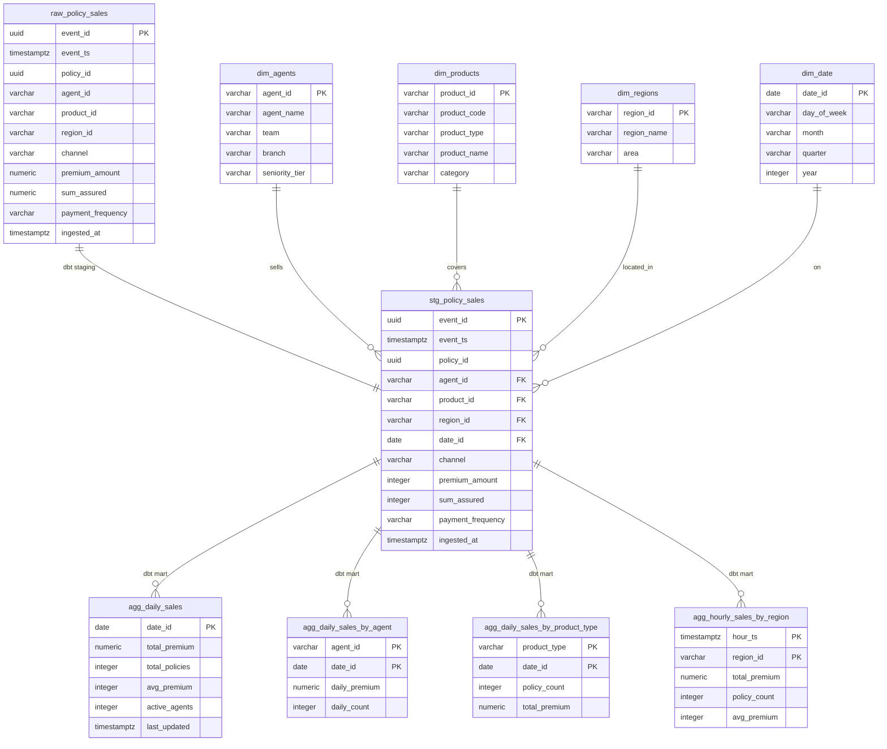

# PCA Life Insurance — Real-Time Policy Sales Dashboard

A containerized pub/sub system that simulates real-time insurance policy sales, streams them through Kafka, transforms with dbt, and visualizes on a live Streamlit dashboard.

## Architecture

```
Producer (Python)          Kafka 4.2.0            Consumer (Python)
Faker generates         ┌────────────────┐       Validates with Pydantic,
policy_sold events  ──► │policy.sales.raw│ ──►   writes to PostgreSQL
every 2 seconds         └────────────────┘
                                                        │
                                                        ▼
Dashboard (Streamlit)      dbt (every 60s)         PostgreSQL 18
Reads from marts,     ◄── raw → staging → marts ◄── raw.policy_sales
auto-refreshes                                      ingested_at + event data
```

## Tech Stack

| Service    | Technology                                    | Role                                       |
|------------|-----------------------------------------------|--------------------------------------------|
| Kafka      | Apache Kafka 4.2.0 (KRaft mode)               | Message broker — no Zookeeper required     |
| Producer   | Python · confluent-kafka · Faker · Pydantic   | Generate and publish policy_sold events    |
| Consumer   | Python · confluent-kafka · Pydantic · psycopg2| Validate and write events to PostgreSQL    |
| PostgreSQL | PostgreSQL 18                                 | Database with raw / staging / marts layers |
| dbt        | dbt-postgres                                  | Transform raw → staging → marts every 60s  |
| Dashboard  | Streamlit · Plotly · pandas                   | Live KPIs, charts, and agent leaderboard   |

## Quick Start

### Prerequisites

- Docker Desktop (v20.10.4+)
- Docker Compose (v2+)
- Git

### Run

```bash
git clone https://github.com/Sean-Liu-GitHub/pca-sales-demo.git
cd pca-sales-demo
cp .env.example .env
docker compose up -d --build
```

Wait ~60 seconds for dbt to complete its first run, then open:

- **Dashboard**: http://localhost:8501
- **PostgreSQL**: `localhost:5432` (user: `pca`, password: `pca_secret`, db: `pca_sales`)

### Stop

```bash
docker compose down       # keep data
docker compose down -v    # reset everything
```

## Project Structure

```
pca-sales-demo/
├── producer/
│   ├── Dockerfile
│   ├── requirements.txt
│   ├── schema.py            # Pydantic event schema (shared with consumer)
│   ├── generator.py          # Faker-based event generator with TWD premiums
│   └── main.py               # Kafka publish loop (every 2s)
├── consumer/
│   ├── Dockerfile
│   ├── requirements.txt
│   └── main.py               # Subscribe, validate, write to raw.policy_sales
├── dbt/
│   ├── Dockerfile
│   ├── entrypoint.sh         # Runs dbt seed + dbt run every 60s
│   ├── dbt_project.yml
│   ├── profiles.yml
│   ├── requirements.txt
│   ├── macros/
│   │   └── generate_schema_name.sql
│   ├── seeds/
│   │   ├── seed_agents.csv    # 20 agents across 5 teams
│   │   ├── seed_products.csv  # 10 insurance products
│   │   └── seed_regions.csv   # 4 Taiwan regions
│   └── models/
│       ├── staging/
│       │   ├── sources.yml
│       │   └── stg_policy_sales.sql
│       └── marts/
│           ├── dim_agents.sql
│           ├── dim_products.sql
│           ├── dim_regions.sql
│           ├── dim_date.sql
│           ├── agg_daily_sales.sql
│           ├── agg_daily_sales_by_agent.sql
│           ├── agg_daily_sales_by_product_type.sql
│           └── agg_hourly_sales_by_region.sql
├── dashboard/
│   ├── Dockerfile
│   ├── requirements.txt
│   └── app.py                # Streamlit dashboard with Plotly charts
├── scripts/
│   └── init.sql               # PostgreSQL schema + raw table DDL
├── docker-compose.yml
├── .env.example
└── .gitignore
```

## Data Model

### Three-Layer Schema

- **raw** — append-only dump from the Kafka consumer. No transformation, includes `ingested_at` timestamp.
- **staging** — cleaned and type-cast by dbt. Derives `date_id` from `event_ts`. Materialized as a view (always fresh).
- **marts** — analytics-ready tables consumed by the dashboard. Materialized as tables (rebuilt every 60s by dbt).

### Entity Relationship Diagram



### Dimension Tables

| Table          | Source            | Description                                              |
|----------------|-------------------|----------------------------------------------------------|
| dim_agents     | seed_agents.csv   | 20 agents with name, team, branch, seniority tier        |
| dim_products   | seed_products.csv | 10 products with code, type, name, category              |
| dim_regions    | seed_regions.csv  | 4 regions: Northern, Central, Southern, Eastern (Taiwan) |
| dim_date       | Generated SQL     | Date spine derived from actual event data                |

### Aggregation Tables

| Table                            | Grain                  | Key Metrics                                         |
|----------------------------------|------------------------|-----------------------------------------------------|
| agg_daily_sales                  | date_id                | total_premium, total_policies, avg_premium, active_agents, last_updated |
| agg_daily_sales_by_agent         | agent_id + date_id     | daily_premium, daily_count                          |
| agg_daily_sales_by_product_type  | product_type + date_id | policy_count, total_premium                         |
| agg_hourly_sales_by_region       | hour_ts + region_id    | total_premium, policy_count, avg_premium            |

### Kafka Event Schema

```json
{
  "event_id": "uuid",
  "event_ts": "2026-04-01T10:23:00Z",
  "policy_id": "uuid",
  "agent_id": "A-007",
  "product_id": "P-001",
  "region_id": "R-001",
  "channel": "agent",
  "premium_amount": 18000,
  "sum_assured": 5000000,
  "payment_frequency": "annual"
}
```

## Dashboard Features

- **Today's KPIs** — total premium, policies sold, average premium, active agents
- **Last refreshed** — shows the timestamp of the most recent event (Taiwan time)
- **Hourly sales trend** — bar chart with 0–24h fixed axis (Taiwan time)
- **Sales by product type** — donut chart breaking down premium by product category
- **Agent leaderboard** — ranked table with agent name, team, branch, policy count, premium
- **Sales by region** — bar chart with premium values displayed inside bars

## Design Decisions

1. **Kafka 4.2.0 with KRaft** — Zookeeper was removed in Kafka 4.0. KRaft combined mode runs broker + controller in a single node, simplifying the Docker setup.

2. **Pydantic for schema validation** — the same `PolicySoldEvent` model validates data at both the producer (generation) and consumer (ingestion), ensuring type safety and constraint checking across the pipeline.

3. **Three-layer schema (raw → staging → marts)** — raw preserves original data for auditability, staging cleans and type-casts, marts are purpose-built for dashboard queries. Each layer has a clear owner and responsibility.

4. **dbt for transformations** — provides dependency management, lineage tracking, and testability. Staging is a view (always reads fresh raw data), marts are tables (rebuilt every 60s). Dimension tables are loaded from seed CSVs.

5. **`ON CONFLICT DO NOTHING`** — the consumer uses upsert semantics so reprocessed messages (from Kafka rebalancing or restarts) don't create duplicates. The UUID primary key guarantees idempotency.

6. **Seed CSVs for dimensions** — agent, product, and region reference data is managed as dbt seeds, separating slowly-changing dimension data from the real-time event stream.

7. **`.env` for configuration** — all credentials and settings centralized in one file, referenced by all services via `env_file` in docker-compose. In production, these would come from a secrets manager.
